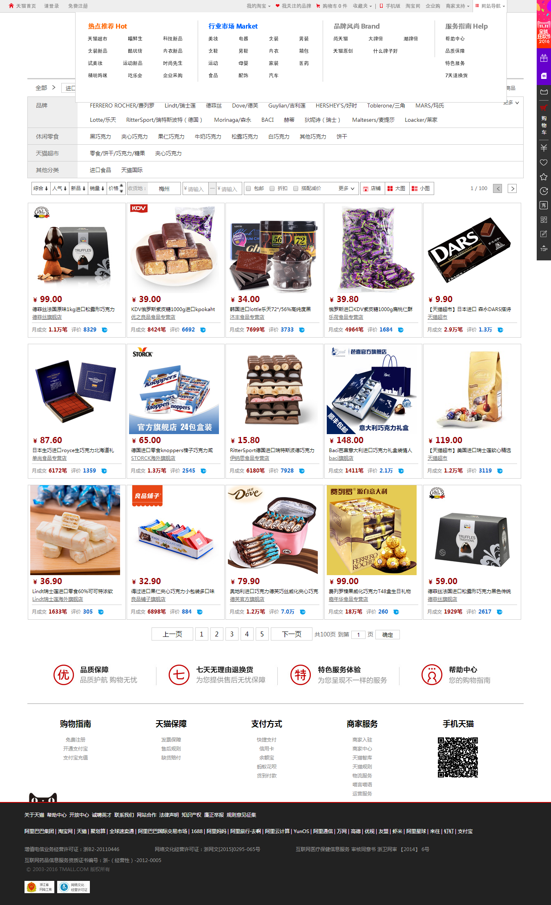
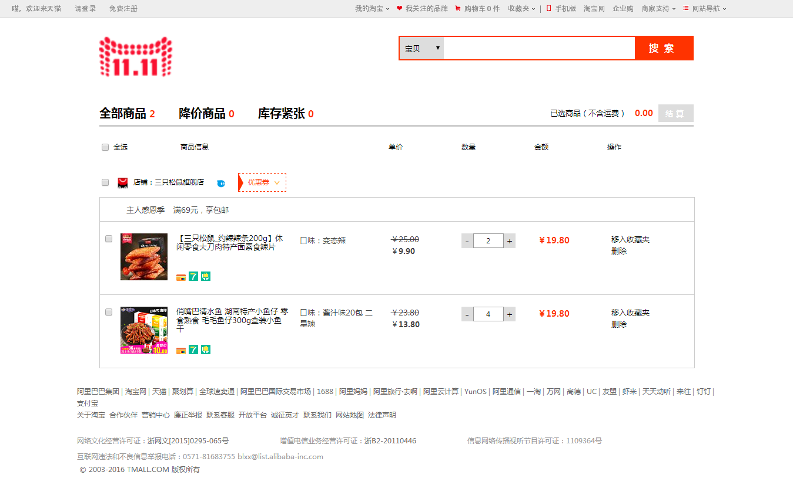
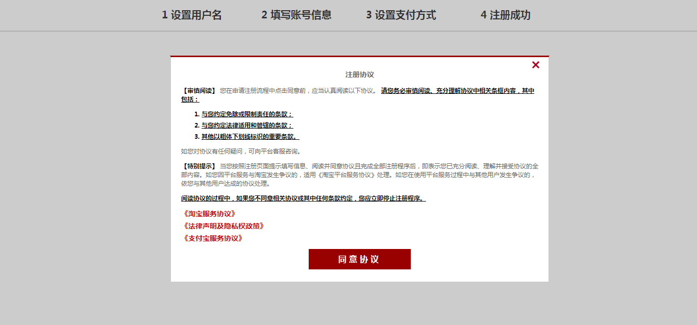
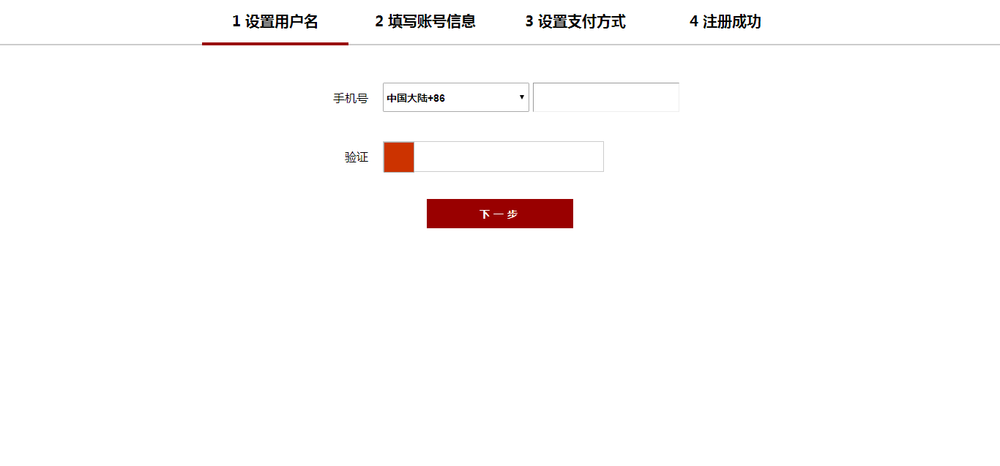
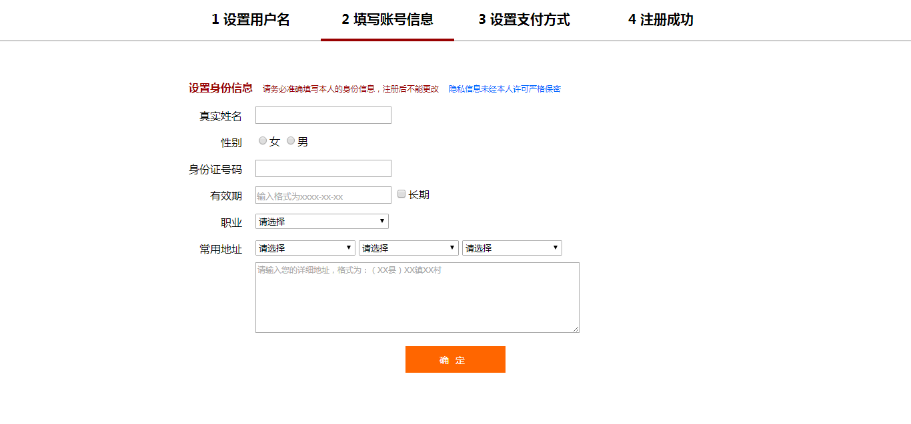
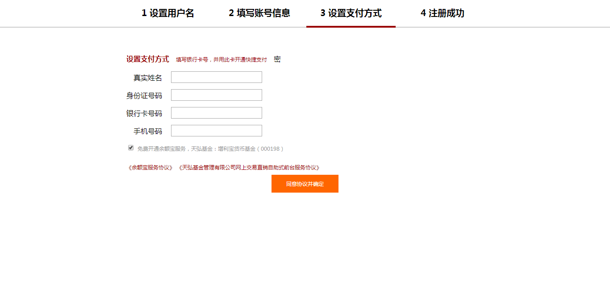
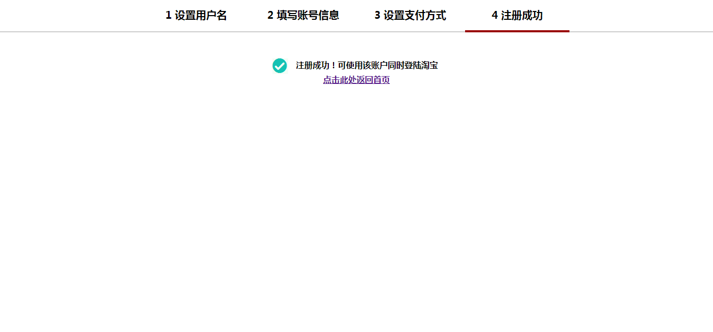

# TMallImitation

# 天猫商城模仿

## 布局页面
* 首页（index.html）
* 分类页（classification.html）
* 产品页（details.html）
* 购物车页面（shoopingCart.html）
* 注册页面（register.html）
* 登录页面（login.html）

### 首页
实现的特效
* 导航栏下拉菜单鼠标经过的显示和隐藏
* 鼠标经过商品图的放大提示
* 商品图的轮播效果
* 滚动条scrollTop大于浏览器高度时顶部显示搜索框、左侧显示隐藏的导航条  

存在的问题
* 商品列表显示行不正确

### 分类页
实现的特效
* 点击品牌更多显示隐藏内容
* 实现鼠标滚动显示和隐藏筛选栏

### 产品页
实现的特效
* 商品图轮播
* 评价的筛选，点击“全部”、“追评”、“图片”分别显示符合条件的内容

### 购物车页面
实现的特效
* 全选、店铺、商品的选择
* 商品价格数目的统计  

存在的问题
* 点击添加商品再减少商品数目价格会出错

### 注册页面
实现的特效
* 检测表单内容是否符合要求
* 输入信息的提示

### 登录页面
实现的特效
* 点击切换登录方式
* 检测账户、密码是否已输入

